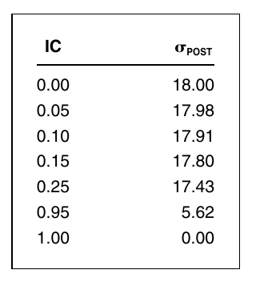

# Study Notes

### Learning Plan

April 30 - May 30, 31 days

__Part 1 Foundations__

Ch2 Consensus Expected Returns: The CAMP   11- 40  3.5h

Ch3 Risk  41 - 85  3h

Ch4 Exceptional Return, Benchmarks, and Value Added  87 - 108 2.5h

Ch5 Residual Risk and Return: The Information Ratio 109 - 145  2h

Ch6 The Fundamental Law of Active Management 147 - 169 1.5h

__Part 2 Expected Returns and Valuation__

Ch7 Expected Returns and the Arbitrage Pricing Theory 173 - 198 1.5h

Ch8 Valuation in Theory 199 - 224 

Ch9 Valuation in Practice 225 - 257

__Part 3 Information Processing__

**Ch10 Forecasting Basics  261 - 293**  1.5h

Ch11 Advanced Forecasting 295 - 314

Ch12 Information Analysis 315 - 345

Ch13 The Information Horizon 347 - 374

__Part 4 Implementation__

Ch14 Portfolio Construction 377 - 418

Ch15 Long/Short Investing 419 - 443

Ch16 Transaction Costs, Turnover, and Trading 445 - 475

Ch17 Performance Analysis 477 - 515

Ch18 Asset Allocation 517 - 539

Ch19 Benchmark Timing  541 - 558

Ch20 The Historical Record for Active Management 559 - 571

Ch21 Open Questions 573 - 576

Ch22 Summary 577 - 580

__Appendix C: Return and Statistics Basics__

## 10.1 Introduction

1. Highlights:
   1. Active management is forecasting
   2. The unconditional or naive forecast is the consensus expected return. The conditional or informed forecast is dependent on the information source. Historical Averages make poor unconditional forecasts
   3. A basic forecasting formula connects the naive and informed forecasts, and handles single and multiple sources of information
   4. The refined forecast has the form volatility * IC * Score
   5. Forecasts of return have negligible effect on forecasts of risk.

## 10.2 Naive, Raw, and Refined Forecasts

1. the naive forecast is the consensus expected return

2. the raw forecast contains the active manager’s information in raw form: an earning estimate, a buy or sell recommendation, etc.

3. The basic forecasting formula transforms raw forecasts into refined forecasts

4. $E[\mathbf{r}|\mathbf{g}] = E[\mathbf{r}] + Cov(\mathbf{r},\mathbf{g})\cdot Var^{-1}(\mathbf{g})\cdot(\mathbf{g}-E[\mathbf{g}])$

   1. $\mathbf{r}$ =  excess return vector (N assets)
   2. $\mathbf{g}$ = raw forecast vector (K forecasts)
   3. $E[\mathbf{r}]$ = naive (consensus) forecast
   4. $E[\mathbf{g}]$ = expected forecast
   5. $E[\mathbf{r}|\mathbf{g}]$ = informed expected return: the expected return conditional on $\mathbf{g}$

5. _refined_ forecast 

   $\boldsymbol{\phi} \equiv E\{\mathbf{r} | \mathbf{g}\}-E\{\mathbf{r}\}=\operatorname{Cov}\{\mathbf{r}, \mathbf{g}\} \cdot \operatorname{Var}^{-1}\{\mathbf{g}\} \cdot(\mathbf{g}-E\{\mathbf{g}\})$

   1. it can include both residual return forecasts and benchmark timing

6. given a benchmark portfolio, the naive forecast is 

   $E\{\mathbf{r}\}=\boldsymbol{\beta} \cdot \mu_{B}$

   1. apply the above to the residual returns we can get 

      $E\{\boldsymbol{\theta}\}=0$

   2. The consensus expected residual returns are 0, and 

      $\boldsymbol{\alpha}=\operatorname{Cov}\{\boldsymbol{\theta}, \mathbf{g}\} \cdot \operatorname{Var}^{-1}\{\mathbf{g}\} \cdot(\mathbf{g}-E\{\mathbf{g}\}) $   (10.5)  Why?

## 10.3 Refining raw information: one asset and one forecast

1. binary model

2. expected quarterly excess return 1.5%, and quarterly volatility 9 %

   $r=1.5+\theta_{1}+\theta_{2}+\cdots+\theta_{81}$

   1. 81 random elements $\theta_i$ capture the uncertain component of the return, it can equally likely to achieve +1 or -1, which has expectation 0 and varaince 1.

3. forecast $g$, has an expected value of 2 % and a standard deviation of 4 %

   $g=2.0+\theta_{1}+\theta_{2}+\theta_{3}+\eta_{1}+\eta_{2}+\cdots+\eta_{13}$

   1. the forecast is a combination of useful and useless information

4. $\mathrm{IC}=\operatorname{Corr}\left\{r_{, g}\right\}=\frac{\operatorname{Cov}\{r, g\}}{\operatorname{Std}\{r\} \cdot \operatorname{Std}\{g\}}=\frac{3}{9 \cdot 4}=0.0833 $   **(10.9)**

5. $\phi=\operatorname{Std}\{r\} \cdot \operatorname{Corr}\{r, g\} \cdot\left(\frac{g-E\{g\}}{\operatorname{Std}\{g\}}\right) = 9 \cdot 0.0833 \cdot \frac{g-2}{4}$

## 10.4 The forecasting rule of Thumb

1. steps to refine the forecast
   1. standardizing the raw forecast and get a _score_ or _z score_
   2. scaling the score to account for the skill level of the forecaster (the IC) and the volatility of the return we are attempting to forecast.

2. $\begin{align}\boldsymbol{\phi} \equiv E\{\mathbf{r} | \mathbf{g}\}-E\{\mathbf{r}\}&=\operatorname{Cov}\{\mathbf{r}, \mathbf{g}\} \cdot \operatorname{Var}^{-1}\{\mathbf{g}\} \cdot(\mathbf{g}-E\{\mathbf{g}\})\\&= \operatorname{Std}\{\mathbf{r}\} \cdot \operatorname{Corr}\{\mathbf{r}, \mathbf{g}\} \cdot\left(\frac{\mathbf{g}-E\{\mathbf{g}\}}{\operatorname{Std}\{\mathbf{g}\}}\right)\\&=\text{volatility}\cdot\text{IC}\cdot \text{score}\end{align}$    **(10.11)**

### 10.4.1 Intuition

1. The refinement process controls for three factors: expectations, skill, and volatility.

## 10.5 Refining Forecasts: One Asset and Two Forecasts

1. new raw forecast $g’$

   $g^{\prime}=0.5+\theta_{3}+\theta_{4}+\theta_{5}+\theta_{6}+\eta_{10}+\eta_{11}+\cdots+\eta_{30}$

   1. $g$ and $g'$ share one element of signal $\theta_3$ and four elements of noise $\eta_{10}, .. \eta_{13}$,
   2. $Var[g'] = 25$, $Cov[r,g'] = 4, Corr[r,g'] = 0.089, Cov[g,g'] = 5$

2. If we use $g'$ only, we would find

   $\phi=9 \cdot(0.089) \cdot\left(\frac{g^{\prime}-0.5}{5}\right)=(0.16) \cdot\left(g^{\prime}-0.5\right)$

   But combining $g$ and $g'$, we find

   $\phi=(0.1467) \cdot(g-2.0)+(0.1307) \cdot\left(g^{\prime}-0.5\right)$

   with an $IC$ for the refined combined forecast of 0.1090.

3. General result

   $\phi=\operatorname{Std}\{r\} \cdot \mathrm{IC}_{g}^{*} \cdot z_{g}+\operatorname{Std}\{r\} \cdot \mathrm{IC}_{g^{\prime}}^{*} \cdot z_{g^{\prime}}$

   1. $\text{IC}^*_g$ and $\text{IC}_{g'}^*$ take into account the correlation between the forecast

      $\mathrm{IC}_{g}^{*}=\frac{\mathrm{IC}_{g}-\rho_{g, g^{\prime}} \cdot \mathrm{IC}_{g^{\prime}}}{1-\rho_{g, g^{\prime}}^{2}}$
      $\mathrm{IC}_{g^{\prime}}^{*}=\frac{\mathrm{IC}_{g^{\prime}}-\rho_{g, g^{\prime}} \cdot \mathrm{IC}_{g}}{1-\rho_{g, g^{\prime}}^{2}}$

   $\mathrm{IC}_{\text {combined }}=\sqrt{\frac{\mathrm{IC}_{g}^{2}+\mathrm{IC}_{g^{\prime}}^{2}-2 \cdot \rho_{g, g^{\prime}} \cdot \mathrm{IC}_{g} \cdot \mathrm{IC}_{g^{\prime}}}{1-\rho_{g, g^{\prime}}^{2}}}$

## 10.6 Refining Forecasts: Multiple Assets and multiple forecasts

1. guidelines: A good forecaster has IC = 0.05, a great forecaster has IC = 0.1, and a world class forecaster has IC = 0.15. An IC higher than 0,2 usually signals a faulty backtest or imminent investigation for insider dealing.

### 10.6.1 A tip

### 10.6.2 Up/Down Forecast

### 10.6.3 Buy and Sell Recommendations

### 10.6.4 Fractiles

### 10.6.5 Rankings

### 10.6.6 The Forecast Horizon: New and Old Forecast

1. Treat the old forecast as a separate source of information and apply the basic forecasting formula

## 10.7 Forecasting and Risk

1. Forecasts of returns have negligible effect on forecasts of volatility and correlation

2. This is because risk measures uncertainty in the return

   1. it depends on the skill of the forecaster to reduce the uncertainty

3. Formula relating the estimate of volatility without forecast information and with forecast information

   $\boldsymbol{\sigma}_{\mathrm{POST}}=\boldsymbol{\sigma}_{\text {PRIOR }} \cdot \sqrt{1-\mathrm{IC}^{2}}$

4. 

   1. IC from 0 to 0.15 have very little effect on the volatility forecasts

5. The researcher who tries to forecast returns over the near horizon should ignore the slight impact of those forecasts on the volatility and correlation estimates for the assets.

## 10.8 Advanced Techniques

1. A guiding principle is to **move from the simple to the more complicated**; master the simple cases, understand the shortcomings, and then move to more complicated situations and techniques. 
2. when using sophisticated techniques, always run two specific tests to make sure they are working correctly. 
   1. First, see how they work when you feed in random data. Successful predictions from random data indicate a problem. 
   2. Second, feed in simulated data where you know the underlying relationship. Does the sophisticated technique find it? Many sophisticated techniques do not come with associated statistical tests. 

### 10.8.1 Time Series Analysis

1. AR(q): $r(t)=a_{0}+a_{1} \cdot r(t-1)+\cdots+a_{q} \cdot r(t-q)+e(t)$

2. MA(p) : $r(t)=e(t)+c_{1} \cdot e(t-1)+\cdots+c_{p} \cdot e(t-p)+c_{0}$
3. ARMA (q,p)
4. ARIMA, ARMA applied to first differences
5. VARMA, ARMA applied to more than one variable at a time, vector ARMA

### 10.8.2 ARCH, GARCH, etc

### 10.8.3 Kalman Filters

1. Kalman filters are closely linked to Bayesian analysis. Our fundamental forecasting law is a simple example. **We start with a prior mean and variance for the returns and then adapt that mean and variance conditional on some new information**. Kalman filters work in the same manner, although their working is often obscured by electrical engineering/optimal control jargon. 

### 10.8.4 Chaos

Chaos theory concerns unstable and nonlinear phenomena. In the investment context, it has come to mean the discovery and use of nonlinear models of return and volatility. We would like to distinguish between random phenomena and predictable phenomena that are generated in a deterministic but highly nonlinear way. These can appear to be the same thing.

A typical example is the random-number generator. Computers generate random numbers in a totally reproducible way, but the numbers appear to be random. The forecaster using **chaos theory starts with the output of the random-number generator and tries to reverse-engineer the nonlinear rules that are used to produce its outputs**. This is not an easy task.

To apply chaos theory to forecasting, take the residuals from the forecasting rules and look at these two-, three-, and higher dimension pictures for evidence of a nonlinear relationship like the tent map. If there is such evidence, strengthen the model by trying to capture that relationship. See the paper by Hsieh (1995) for an excellent application of this idea and some interesting modeling techniques.

### 10.8.5 Neural Nets

### 10.8.7 Genetic Algorithm

# Problems

