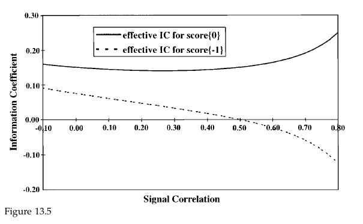
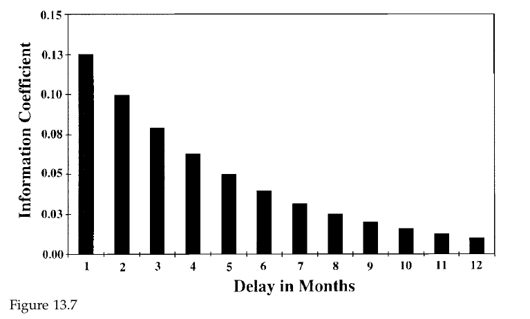
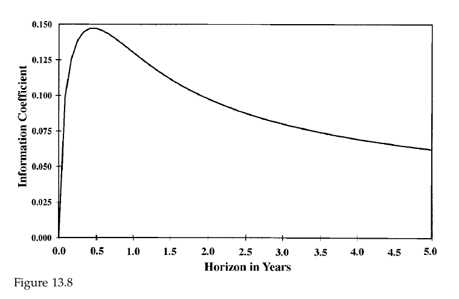
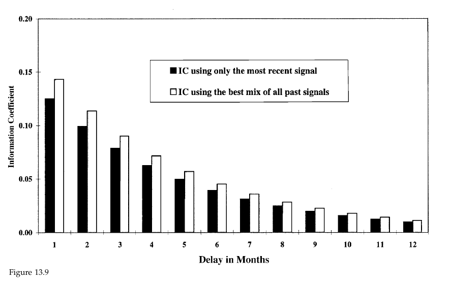

# Study Notes

### Learning Plan

April 30 - May 30, 31 days

__Part 1 Foundations__

Ch2 Consensus Expected Returns: The CAMP   11- 40  3.5h

Ch3 Risk  41 - 85  3h

Ch4 Exceptional Return, Benchmarks, and Value Added  87 - 108 2.5h

Ch5 Residual Risk and Return: The Information Ratio 109 - 145  2h

Ch6 The Fundamental Law of Active Management 147 - 169 1.5h

__Part 2 Expected Returns and Valuation__

Ch7 Expected Returns and the Arbitrage Pricing Theory 173 - 198 1.5h

Ch8 Valuation in Theory 199 - 224  1h

Ch9 Valuation in Practice 225 - 257

__Part 3 Information Processing__

Ch10 Forecasting Basics  261 - 293  1.5h

Ch11 Advanced Forecasting 295 - 314  1.5h

Ch12 Information Analysis 315 - 345  1.5h

**Ch13 The Information Horizon 347 - 374**  

__Part 4 Implementation__

Ch14 Portfolio Construction 377 - 418

Ch15 Long/Short Investing 419 - 443

Ch16 Transaction Costs, Turnover, and Trading 445 - 475

Ch17 Performance Analysis 477 - 515

Ch18 Asset Allocation 517 - 539

Ch19 Benchmark Timing  541 - 558

Ch20 The Historical Record for Active Management 559 - 571

Ch21 Open Questions 573 - 576

Ch22 Summary 577 - 580

__Appendix C: Return and Statistics Basics__

## 13.1 Introduction

1. Time dimension to information
2. highlights
   1. information horizon should be defined as the half-life of the information's forecasting ability
   2. A strategy's horizon is an intrinsic property. Time averages or time differences can change performance, but they will not change the horizon
   3. Lagged signals or scores and past returns can improve investment performance

## 13.2 MacroAnalysis of The Information Horizon

1. Half-life is robust characteristic but have little or no effect on the strategy's half-life
2. The ability to add value is proportional to the square of the information ratio
3. given a decay rate $\tau$ and a correlation $\rho$, the optimal weight is
   1. $w_{\mathrm{Now}}^{*}=\frac{\gamma+x}{\gamma+1}$  where $x \equiv \frac{1-\gamma}{1-\rho}$
4. Combing the old and new strategy can improve the IR

## 13.3 MicroAnalysis of the Information Horizon

1. $\alpha(\Delta t)=(\sigma \cdot \sqrt{\Delta t}) \cdot \operatorname{IC}(\Delta t) \cdot s(0)$
   1. Where $IC(\Delta t)$ is the correlation of the score with the return over the period $\{ 0,\Delta t\}$. Given a score $s(0)$,  $\alpha(\Delta t) = E(r(0,\Delta t)|s(0))$
2. Information ratio here:
   1. $\mathrm{IR}^{2}=[\mathrm{IC}(\Delta t)]^{2} \cdot\left(\frac{1}{\Delta t}\right)$
      1. We measure the breadth BR as simply the inverse of the period $1/\Delta t$
      2. Here is the tradeoff between arrival rate, captured by $\Delta t$ and the accuracy, captured by $IC(\Delta t)$

## 13.4 Two-Period Shelf Life

1. Let’s consider the cases where the interarrival time is shorter than the shelf life

   1. in particular, we receive scores each period, and a score’s shelf life is two periods long
   2. We can measure the IC of the score on a period-by-period basis
      1. $IC_{1\&2} = \frac{IC_1 + IC_2}{\sqrt{2}}$
         1. Where $IC_1$ measures the correlation between the score and the first period’s return, $IC_2$ measures the correlation between the score and the second period’s return

2. We can optimally combine two separate signals $s(0)$ and $s(-\Delta t)$ by using the formula from Chap. 10
   $$
   \alpha(\Delta t) = \sigma \sqrt {\Delta t} \times  \{IC_1^*\times s(0) + IC_2^*\times s(-\Delta t)\}
   $$

   1. Where $IC_1^* = \frac{IC_1 - \rho IC_2}{1-\rho^2}$ and $IC_2^* = \frac{IC_2 - \rho IC_1}{1-\rho^2}$, They are corrected for the correlation

3. Modified information coefficients change as the correlation between the signals varies, assuming $IC_1 = 0.15$ and $IC_2 = 0.075$ 

4. The lagged score $s(-\Delta t)$ can help improve the forecast in one of two ways
   1. _Diversification_, a second predictor of the return $r(0,\Delta t)$
   2. _Hedging_ :  a way to reduce the noise in $s(0)$
5. The combined forecast dominates either the first or the second score in isolation

## 13.7 Has the Alpha been realized?

1. We want to see how much old information is left after the prediction is realized in some degree.

2. The rule for adapting to the observed return changes the previous score and is thus called “settling old scores”, the settled score is 
   $$
   s^*(-\Delta t) = s(-\Delta t) - IC_1 \frac{r(-\Delta t,0)}{\sigma \sqrt{\Delta t}}
   $$

   1. Where $r(-\Delta t,0)/\sigma\sqrt{\Delta t}$ is the score for past return
   2. Assumption: no serial correlation in the returns and no correlation between past returns and current scores.
   3. The “correction” in the previous score, the term $IC_1 \times Score_r$ is the part of the score that has been used up. The greater the ability to predict, the more we discount from the score
   4. Usually, the settling score effect is small, since the impact depends on the product of $IC_1$ and $IC_2^*$.

## 13.8 Gradual Decline in the value of the information

1. continuous decay to the half-life

   $\delta = (\frac{1}{2})^{\Delta t / HL}$    or $HL  = \frac{-\Delta t \times ln2}{ln \delta}$

   

2. What influence the IC for longer and longer return horizon

   1. pos: the longer return horizon should more completely reflect the signal’s information

   2. neg: increasing volatility, $\sigma\sqrt{t}$, accompanies the longer time periods

   3. $IC(0,t) = Corr[r(0,t), s(0)] = IC \times \sqrt{\frac{\Delta t}{t}}\frac{1-\delta^{t/\Delta t}}{1-\delta}$

      1. Where $IC = IC(0,\Delta t)$

      

   4. The signal has its highest IC when the horizon is about twice the half-life of the signal.

3. As the new signals arrive, the ability to combine it with past signals hinge on two parameters :

   1. decay factor $\delta$
   2. The correlation $\rho$ between the adjacent scores
      1. $\delta = \rho$ : the most recent score has all the information we need
      2. $\delta > \rho$ : we can diversify by using past scores to reinforce the information
      3. $\delta < \rho$ : we can hedge the noise in the new signal by using the past signals

4. Formula to mix the signals

   1. $s^*(0) = \sum_{m=0} \delta^m\{s(-m\Delta t) - \rho s(-(m-1)\Delta t)\} = s(0) - \rho s(-\Delta t) + \delta s^*(-\Delta t)$
   2. 

