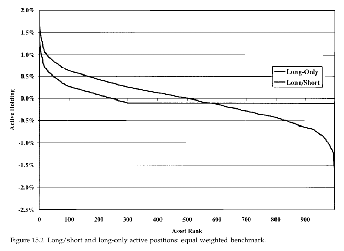

# Study Notes

### Learning Plan

April 30 - May 30, 31 days

__Part 1 Foundations__

Ch2 Consensus Expected Returns: The CAMP   11- 40  3.5h

Ch3 Risk  41 - 85  3h

Ch4 Exceptional Return, Benchmarks, and Value Added  87 - 108 2.5h

Ch5 Residual Risk and Return: The Information Ratio 109 - 145  2h

Ch6 The Fundamental Law of Active Management 147 - 169 1.5h

__Part 2 Expected Returns and Valuation__

Ch7 Expected Returns and the Arbitrage Pricing Theory 173 - 198 1.5h

Ch8 Valuation in Theory 199 - 224  1h

Ch9 Valuation in Practice 225 - 257

__Part 3 Information Processing__

Ch10 Forecasting Basics  261 - 293  1.5h

Ch11 Advanced Forecasting 295 - 314  1.5h

Ch12 Information Analysis 315 - 345  1.5h

Ch13 The Information Horizon 347 - 374  Mon  3h

__Part 4 Implementation__

Ch14 Portfolio Construction 377 - 418 0519  Tue  3h

**Ch15 Long/Short Investing 419 - 443 0520 Sun **1h

Ch16 Transaction Costs, Turnover, and Trading 445 - 475 0521 Sun

Ch17 Performance Analysis 477 - 515 0522 Mon

Ch18 Asset Allocation 517 - 539 0523 Tue

Ch19 Benchmark Timing  541 - 558  0524 Wed

Ch20 The Historical Record for Active Management 559 - 571 0525 Thur

Ch21 Open Questions 573 - 576 Fri

Ch22 Summary 577 - 580

__Appendix C: Return and Statistics Basics__

## 15.1 Introduction

1. key:
   1. The benefits of long/short investing arise from the loosening of the long-only constraint
   2. long/short implementations offer the most improvement over long-only implementations when the universe of assets is large, the assets’ volatility is low, and the strategy has high active risk
   3. The long-only constraint tends to induce biases, particularly toward small stocks. Surprisingly, it can limit the ability to completely act on upside information, by not allowing short positions that could finance long positions.
2. Definition of long/short investing: equity market–neutral strategies
3. These strategies have betas of 0 and equal long and short positions

## 15.2 The Controversy

## 15.3 The Surprising Impact of the long-only constraint

1. under long-only constraint

   active position $h_{n}=\frac{\alpha_{n}}{2 \cdot \lambda_{R} \cdot \omega^{2}}$

   residual risk $\psi_{P}^{2}=\frac{1}{4 \cdot \lambda_{R}^{2} \cdot \omega^{2}} \cdot \sum_{n=1}^{N} \alpha_{n}^{2}$

   Where $\alpha_n$ is the expected residual return on asset n and $\lambda_R$ is the residual risk aversion. Also, we supposed that N assets are equal weighted and each has identical residual risk $\omega$ and that residual returns are uncorrelated.

2. We know from ch10 that $\alpha_n = \omega(IR/\sqrt{N})z_n$, so

   $h_{n}=\frac{\mathrm{IR} \cdot z_{n}}{2 \cdot \lambda_{R} \cdot \omega \cdot \sqrt{N}}$

   $\psi_{P}=\frac{\mathrm{IR}}{2 \cdot \lambda_{R}} \cdot \sqrt{\frac{1}{N} \sum_{n=1}^{N} z_{n}^{2}} \approx \frac{\mathrm{IR}}{2 \cdot \lambda_{R}}$

   So, we can link active position with the desired level of active risk by

   $h_{n}=\frac{\psi_{P} \cdot z_{n}}{\sqrt{N} \cdot \omega}$

3. The limitation on short sales becomes binding when the active position plus the benchmark holding is negative. For an equal weighted benchmark, this occurs when

   $z_{n} \leq-\frac{\omega}{\sqrt{N} \cdot \psi_{p}}$

4. So information is wasted if the z score falls below the minimum level

### 15.3.1 Long-only Indirect effect

1. direct effect: preclude exploiting the most negative alphas
2. indirect effect: Overweights require underweights
3. 

## 15.4 The importance of the benchmark distribution

1. the potential for a significant size imbalance. The shortage of negative active positions causes relatively larger underweighting decisions on the higher-capitalization stocks

## 15.5 The Appeal of Long/Short Investing

