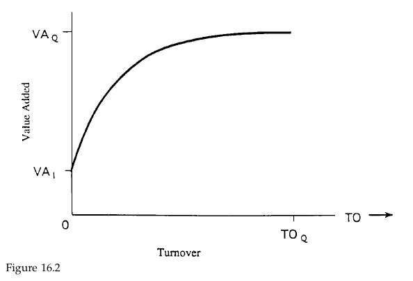
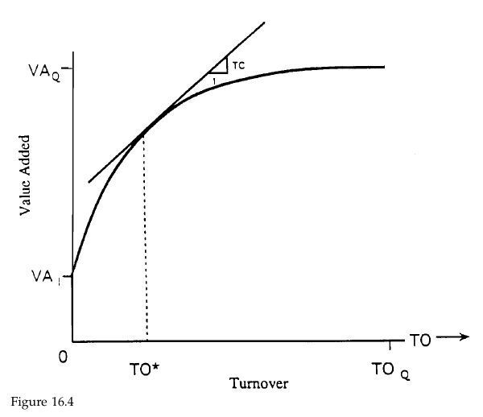

# Study Notes

### Learning Plan

April 30 - May 30, 31 days

__Part 1 Foundations__

Ch2 Consensus Expected Returns: The CAMP   11- 40  3.5h

Ch3 Risk  41 - 85  3h

Ch4 Exceptional Return, Benchmarks, and Value Added  87 - 108 2.5h

Ch5 Residual Risk and Return: The Information Ratio 109 - 145  2h

Ch6 The Fundamental Law of Active Management 147 - 169 1.5h

__Part 2 Expected Returns and Valuation__

Ch7 Expected Returns and the Arbitrage Pricing Theory 173 - 198 1.5h

Ch8 Valuation in Theory 199 - 224  1h

Ch9 Valuation in Practice 225 - 257

__Part 3 Information Processing__

Ch10 Forecasting Basics  261 - 293  1.5h

Ch11 Advanced Forecasting 295 - 314  1.5h

Ch12 Information Analysis 315 - 345  1.5h

Ch13 The Information Horizon 347 - 374  Mon  3h

__Part 4 Implementation__

Ch14 Portfolio Construction 377 - 418 0519  Tue  3h

Ch15 Long/Short Investing 419 - 443 0520 Sun 1h

**Ch16 Transaction Costs, Turnover, and Trading 445 - 475 0521 Sun ** 1h

Ch17 Performance Analysis 477 - 515 0522 Mon

Ch18 Asset Allocation 517 - 539 0523 Tue

Ch19 Benchmark Timing  541 - 558  0524 Wed

Ch20 The Historical Record for Active Management 559 - 571 0525 Thur

Ch21 Open Questions 573 - 576 Fri

Ch22 Summary 577 - 580

__Appendix C: Return and Statistics Basics__

## 16.1 Introduction

1. key:
   1. deal with transactions costs and turnover more broadly (how they arise), more concretely (how to estimate them), and more strategically (how to reduce these costs while preserving as much of the strategy’s value added as possible). 
   2. We will attack the strategic issue in two ways: 
      1. reducing transactions costs by reducing turnover while retaining as much of the value added as possible, and 
      2. reducing transactions costs through optimal trading.
   3. Transactions costs increase with trade size and the desire for quick execution, which help to identify the manager as an informed trader and require increased inventory risk by the liquidity supplier.
   4.  Transactions costs are difficult to measure. At the same time, accurate estimates of transactions costs, especially distinctions in transactions costs among different stock trades, can significantly affect realized value added.
   5. Transactions costs lower value added, but you can often achieve at least 75 percent of the value added with only half the turnover (and half the transactions costs). You can do better by distinguishing stocks by their transactions costs.
   6. Trading is itself a portfolio optimization problem, distinct from the portfolio construction problem. Optimal trading can lower transactions costs, though at the expense of additional short-term risk.
   7. There are several options for trade implementation, with rules of thumb on which to use when.

## 16.2 Market Microstructure

1. The larger and more urgent the trade, the more likely it is that the manager is
   informed, and the higher the price concession the liquidity supplier will demand. Market impact increases with trading volume.
2.  inventory risk

## 16.3 Analyzing and Estimating Transactions costs

1.  The best place to start is with the manager’s past record of transactions and the powerful “implementation shortfall” approach to measuring the overall cost of trading.
2. The most difficult approach to transactions cost analysis is to directly research market tick-by-tick data. Both the previously described methods began with a particular manager’s trades. When analyzing tick-by-tick data, we do not even know whether each trade was buyer- or seller-initiated.
3. $\frac{\Delta P}{P}=c \cdot \sigma_{\text {inventory }}$
   1. Where $c$ is the risk/return trade-off, $\sigma_{\text {invertory }}=\sigma \cdot \sqrt{\frac{\tau_{\text {clear }}}{250}}$
   2. Where $\sigma$ is the stock’s annual volatility and $\tau_{\text {clear }} \propto \frac{V_{\text {trade }}}{\bar{V}_{\text {daily }}}$
4. $\operatorname{cost}=\operatorname{commisson}+\left(\frac{\text { bid } / \text { ask spread }}{\text { price }}\right)+c_{\mathrm{tc}} \cdot \sqrt{\frac{V_{\text {trade }}}{\bar{V}_{\text {daily }}}}$
   1. Where $c_{tc}$ includes the stock’s volatility, a risk/return trade-off and the conversion from annual to daily units $c_{tc} \sim O\{\sigma/\sqrt{250}\}$
   2. One consequence of this inventory risk approach is that market impact should increase as the square root of the amount traded
5. The BARRA market impact model uses the distribution of trade frequency, trade size, and elasticity to estimate time to clear, given any particular desired trade size.

## 16.4 Turnover, transactions costs, and value added

1. value added for portfolio P: $\mathrm{VA}_{p}=\alpha_{p}-\lambda_{A} \cdot \psi_{p}^{2}$

2. consider a choice set CS and the increase in value added as we move from portfolio I to portfolio Q is 

   $\Delta \mathrm{VA}_{\mathrm{Q}}=\mathrm{VA}_{Q}-\mathrm{VA}_{l}$

3. Let $TO_P$ represent the amount of turnover needed to move from portfolio I to portfolio P. if $\bold{h}_P$ is the initial portfolio and $\bold{h}_P^*$ is the revised portfolio, then the purchase turnover is 

   $\mathrm{TO}_{p}=\sum_{n} \operatorname{Max}\left\{0, h_{p_{n}}^{*}-h_{p_{n}}\right\}$

   The sales turnover is 

   $\mathrm{TO}_{\mathrm{s}}=\sum_{n} \operatorname{Max}\left\{0, h_{p_{n}}-h_{P, n}^{*}\right\}$

4. Turnover: minimum of purchase and sales turnover. $\mathrm{TO}=\operatorname{Min}\left\{\mathrm{TO}_{p}, \mathrm{TO}_{s}\right\}$. If there is no cash position change, $TO_p = TO_s$

5. 

   Let VA(TO) be the maximum amount of value added if turnover is less than
   or equal to TO. The concave shape of the curve indicates a decreasing marginal return for each additional amount of turnover that we allow.

### 16.4.1 A lower Bound

1. $\mathrm{VA}(\mathrm{TO}) \geq \mathrm{VA}_{I}+\Delta \mathrm{VA}_{Q} \cdot\left[2 \cdot\left(\frac{\mathrm{TO}}{\mathrm{TO}_{\mathrm{Q}}}\right)-\left(\frac{\mathrm{TO}}{\mathrm{TO}_{\mathrm{Q}}}\right)^{2}\right]$
   1. You can achieve at least 75 percent of the (incremental) value added
      with 50 percent of the turnover.

### 16.4.2 The value of scheduling trades

### 16.4.3 Transactions Costs

1. The simplest assumption we can make about transactions costs is that round-trip costs are the same for all assets

2. Let TC be that level of costs and we wish to choose a portfolio P in CS that will maximize 

   $\mathrm{VA}_{\mathrm{p}}-\mathrm{TC} \cdot \mathrm{TO}$

3. 

### 16.4.4 Implied Transactions Costs

## 16.5 Trading as a portfolio optimization problem

1. Utility $=\alpha_{\text {short }}-\lambda_{S} \cdot \psi_{\text {short }}^{2}-\mathrm{MI}$
   1. short-term alpha minus a short-term risk adjustment, minus market impact

## 16.6 Trade Implementation

1. limit order and market order

