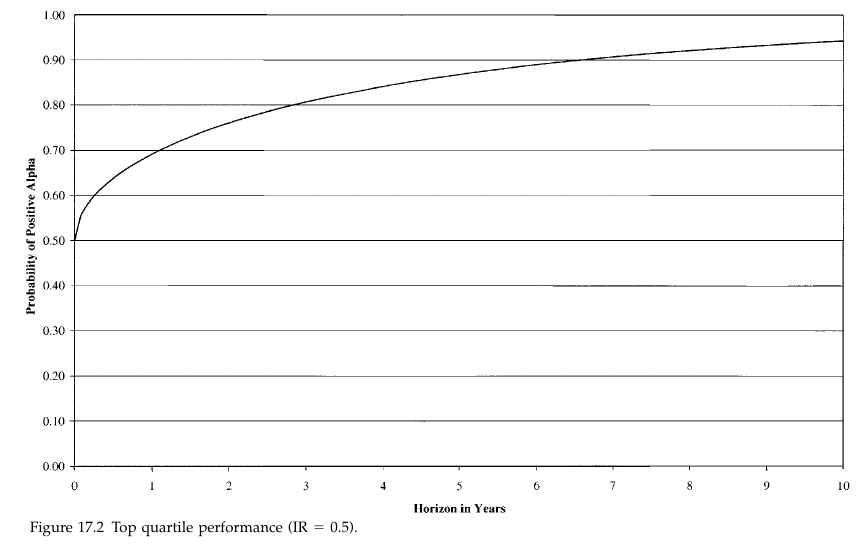

# Study Notes

### Learning Plan

April 30 - May 30, 31 days

__Part 1 Foundations__

Ch2 Consensus Expected Returns: The CAMP   11- 40  3.5h

Ch3 Risk  41 - 85  3h

Ch4 Exceptional Return, Benchmarks, and Value Added  87 - 108 2.5h

Ch5 Residual Risk and Return: The Information Ratio 109 - 145  2h

Ch6 The Fundamental Law of Active Management 147 - 169 1.5h

__Part 2 Expected Returns and Valuation__

Ch7 Expected Returns and the Arbitrage Pricing Theory 173 - 198 1.5h

Ch8 Valuation in Theory 199 - 224  1h

Ch9 Valuation in Practice 225 - 257

__Part 3 Information Processing__

Ch10 Forecasting Basics  261 - 293  1.5h

Ch11 Advanced Forecasting 295 - 314  1.5h

Ch12 Information Analysis 315 - 345  1.5h

Ch13 The Information Horizon 347 - 374  Mon  3h

__Part 4 Implementation__

Ch14 Portfolio Construction 377 - 418 0519  Tue  3h

Ch15 Long/Short Investing 419 - 443 0520 Sun 1h

Ch16 Transaction Costs, Turnover, and Trading 445 - 475 0521 Sun 1h

**Ch17 Performance Analysis 477 - 515 0522 Mon**  2h

Ch18 Asset Allocation 517 - 539 0523 Tue

Ch19 Benchmark Timing  541 - 558  0524 Wed

Ch20 The Historical Record for Active Management 559 - 571 0525 Thur

Ch21 Open Questions 573 - 576 Fri

Ch22 Summary 577 - 580

__Appendix C: Return and Statistics Basics__

## 17.1 Introduction

1. Performance analysis can help the manager avoid two major pitfalls
   1. _incidental risk_
   2. _incremental decision making_: each good decision may be dangerous come together
2. key:
   1. The goal of performance analysis is to separate skill from luck. Cross-sectional comparisons are not up to this job
   2. Returns-based performance analysis is the simplest method for analyzing both return and risk, and distinguishing skill from luck
   3. Portfolio-based performance analysis is the most sophisticated approach to distinguishing skill and luck along many different dimensions.
   4. Performance analysis is most valuable to the sponsor (client) when there is an ex ante agreement on the manager’s goals and an indication of how the manager intends to meet those goals.
   5.  Performance analysis is valuable to the manager in that it lets the manager see which active management decisions are compensated and which are not.

## 17.2 Skill and Luck

1. standard error of information ratio

   $\mathrm{SE}\{\mathrm{IR}\} \approx \frac{1}{\sqrt{Y}}$, Where $Y$ measures the number of _years_ of observation

2. 

## 17.3 Defining Returns

1. . Should we use compound returns or average returns, arithmetic returns or logarithmic returns?
   1. Compound returns have the benefit of providing an accurate measure of the value of the ending portfolio
   2. Arithmetic returns provide the benefit of using a linear model of returns across periods
2. Suppose $g_P$ is the _geometric average return_, $z_P$ is _average log return_, $a_P$ is the arithmetic return $a_P$
   1. $\left(1+g_{P}\right)^{T}=\prod_{t=1}^{T} R_{P}(t)$
   2. $e^{z_{p} \cdot T}=\prod_{t=1}^{T} R_{p}(t)$
      1. $z_{P}=\left(\frac{1}{T}\right) \cdot \sum_{t=1}^{T} \ln \left\{R_{P}(t)\right\}$
   3. $1+a_{P}=\left(\frac{1}{T}\right) \cdot \sum_{t=1}^{T} R_{P}(t)$
   4. It is always true that $z_P \le g_P \le a_P$
      1. $z_{p}=\ln \left\{1+g_{p}\right\}<g_{p}$ by the convexity of the logarithm function.
         1. $z_{p}=\ln \left\{1+g_{p}\right\} \approx g_{p}-0.5 \cdot g_{p}^{2}$
      2. By convexity, $\begin{aligned}\left(\frac{1}{T}\right) \cdot \sum_{t=1}^{T} \ln \left\{R_{P}(t)\right\} &=\ln \left\{1+g_{P}\right\} \\ & \leq \ln \left\{\left(\frac{1}{T}\right) \cdot \sum_{t=1}^{T} R_{P}(t)\right\} \\ &=\ln \left\{1+a_{p}\right\} \end{aligned}$
      3. so $g_{P} \leq a_{p}$ 
3.  It does indicate that consistency is important, to make sure we are not comparing apples and oranges.

## 17.4 Cross-Sectional Comparisons

1. drawbacks
   1.  They typically do not represent the complete population of institutional investment managers.
   2.  These cross-sectional comparisons usually contain survivorship bias, which is increasingly severe the longer the horizon.
   3. These cross-sectional comparisons ignore the fact that some of the reporting managers are managing 150 million portfolios, while others are managing 15 billion portfolios.
   4. Cross-sectional comparisons do not adjust for risk
2. Performance analysis must account for both return and risk.

## 17.5 Returns-based performance analysis : basic

1. According to the CAPM, the residual return should be zero, and positive deviations from zero signify positive performance
2. The CAPM also states that the market portfolio has the highest Sharpe ratio (ratio of excess return to risk), and Sharpe (1970) proposed performance analysis based on comparing Sharpe ratios.

### 17.5.1 Returns Regression

1. $r_{P}(t)=\alpha_{p}+\beta_{p} \cdot r_{B}(t)+\epsilon_{p}(t)$

2. $t_{P} \approx\left(\frac{\alpha_{P}}{\omega_{P}}\right) \cdot \sqrt{T}$, t statistic for alpha

3. While Jensen focused on alphas and t statistics, information ratios, given their relationship to value added, are also important for performance analysis.

4. basic alternative to the Jensen approach is to compare Sharpe ratios for the portfolio and the benchmark

   $\frac{\bar{r}_{P}}{\sigma_{P}}>\frac{\bar{r}_{B}}{\sigma_{B}}$

   1. the standard error of each Sharpe ratio is approximately 1/$\sqrt{N}$, where N is the number of observations

5.  a statistically significant (95 percent confidence level) demonstration of skill occurs when $\left(\frac{\bar{r}_{P}}{\sigma_{P}}-\frac{\bar{r}_{B}}{\sigma_{B}}\right)>2 \cdot \sqrt{\frac{2}{N}}$

## 17.6 Return-Based Performance Analysis: Advanced

1. Examples of **statistical refinements** include Bayesian corrections and adjustments for heteroskedasticity and autocorrelations.
2.  Other refinements stem from **financial theory**. They attempt to extract additional information from the time series of returns. Examples of financial refinements include analyzing benchmark timing, using a priori betas, analyzing value added, controlling for public information, style analysis, and controlling for size and value.

### 17.6.1 Bayesian Correction

1. The Bayesian analysis allows one to take this prior information into consideration in making judgments about the “true” values of $\alpha_{p}$ and $\beta_{P}$

### 17.6.2 Heteroskedasticity

1. One of the assumptions underlying the regression model is that the error terms $\epsilon_{p}(t)$ have the same standard deviation for each $t$ We can employ various schemes to guard against failure of that assumption. We call this heteroskedasticity in the regression game.

## 17.6.3 Autocorrelation

1. A third statistical problem is autocorrelation. We assume that the error terms $\epsilon_{P}(t)$ are uncorrelated. If there is significant autocorrelation, then we can make an adjustment. This arises, for example, if we examine returns on overlapping periods.

## 17.6.4 Benchmark Timing

1. $r_{P}(t)=\alpha_{p}+\beta_{p} \cdot r_{B}(t)+\gamma_{P} \cdot \operatorname{Max}\left\{0, r_{B}(t)\right\}+\epsilon_{P}(t)$
   1. We include the variable $\gamma_p$ to determine whether the manager has any benchmark timing skill
   2. If $\gamma_p$ is significantly positive, then we say that there is evidence of timing skill; benchmark exposure is significantly different in up and down cases.

### 17.6.5 A Priori Beta Estimates

1. This can take the form of using a beta that is estimated before the fact and change the portfolio’s alpha

### 17.6.6 Value Added

1.  The idea is to look at the pattern of portfolio excess returns and market excess returns

### 17.6.7 Controlling for Public Information

1. Claims:
   1. public information on dividend yields and interest rates can usefully predict market conditions
   2. managers earn their living through nonpublic information
2. $\begin{aligned} r_{P}(t)=\alpha_{p}+\beta \cdot r_{B}(t)+\beta_{y} \cdot\left[r_{B}(t) \cdot y(t-1)\right] +& \beta_{i} \cdot\left[r_{B}(t) \cdot i_{F}(t-1)\right]+\epsilon_{P}(t) \end{aligned}$
   1. allows for beta varying with economic conditions, as modeled linearly through the market dividend yield $y(t)$ and the risk-free rate $i_F(t)$

### 17.6.8 Style Analysis

1. Style analysis attempts to extract as much information as possible from the time series of portfolio returns without requiring the portfolio holdings
2.  Like the factor model approach, style analysis assumes that portfolio returns have the form $r_{P}(t)=\sum_{j=1}^{J} h_{P j} \cdot r_{j}(t)+u_{P}(t)$
   1. Where the $\left\{r_{j}(t)\right\}$ are returns to $J$ styles, the $h_{p_{j}}$ measure the portfolio's holdings of those styles, and $u_{p}(t)$ is the selection return, the portion of the return which style cannot explain
3. we can use style analysis to 
   1.  identify manager style
      1. controversial: the large standard errors associated with the estimated weights, driven in part by the significant correlation between the style indices.
   2.  analyze performance
      1.  may also be inaccurate
   3. analyze risk
      1.  Risk prediction would follow from these exposures, a style index covariance matrix, and an estimate of selection risk (based on historical selection returns).

### 17.6.9 Controlling for Size and Value

1. $r_{P}(t)=\alpha_{p}+\beta \cdot r_{B}(t)+\beta_{s} \cdot \operatorname{SMB}(t)+\beta_{V} \cdot \operatorname{HML}(t)+\epsilon_{p}(t)$
   1. Fama and French Method
   2. SMB(t) (“small minus big”) is the return to a portfolio long small-capitalization stocks and short large-capitalization stocks
   3. HML(t) (“high minus low”) is the return to a portfolio long high-book-to-price stocks and short low-book-to-price stocks.

## 17.7 Portfolio-Based Performance Analysis

1. Returns-based analysis is a **top-down approach to attributing returns to components, ex post, and statistically analyzing the manager’s added value**

2. Portfolio-based performance analysis is a **bottom-up approach, attributing returns to many components based on the ex-ante portfolio holdings** and then giving managers credit for returns along many of these components.
3. two additional items of information can help in the analysis of performance
   1. portfolio holdings over time
   2. goals and strategy of the manager
4. The analysis proceeds in two steps: performance attribution and performance analysis
   1.  Performance attribution focuses on a single period, attributing the return to several components. 
   2. Performance analysis then focuses on the time series of returns attributed to each component.

### 17.7.1 Performance Attribution

1. $r_{P}(t)=\sum_{j} x_{P j}(t) \cdot b_{j}(t)+u_{P}(t)$

2.  The return attributed to factor j is $r_{P j}(t)=x_{P j}(t) \cdot b_{j}(t)$

3. The portfolio’s specific return is  $u_{p}(t)$

4. We are free to choose factors as described in Chap. 3, and in fact we typically run performance attribution using the same risk model factors. However, **we are not in principle limited to the same factors as are in our risk model**

5.  we want to choose some factors for risk control and others as sources of return

6. The return factors can include typical investment themes such as value or momentum. In building risk models, we always use ex ante factors. For return attribution, we could also consider **ex post factors**:   For example, we could use a factor based on IBES earnings forecasts available at the end of the period. We could interpret returns attributed to this factor as evidence of the manager’s skill in forecasting IBES earnings projections

7. active returns performance attribution:

   1. $r_{P A}(t)=\sum_{j} x_{P A j}(t) \cdot b_{j}(t)+u_{P A}(t)$

   2. To break down active returns into systematic and residual, remember that we can define residual exposures as   active exposure minus the active beta times the benchmark’s exposure

      $x_{P A R j}=x_{P A j}-\beta_{P A} \cdot x_{B j}$

   3. Residual Hodings

      $h_{P A R n}=h_{P A n}-\beta_{P A} \cdot h_{B n}$

   4. So  as  $u_{PA} = \sum_{n} h_{P A n} \cdot u_{n}$, we find 

      $r_{P A}(t)=\beta_{P A} \cdot r_{B}(t)+\sum_{j} x_{P A R j}(t) \cdot b_{j}(t)+u_{P A R}(t)$  (17.23)

      This allow a very detailed analysis of the sources of active returns relative to the benchmark

### 17.7.2 Performance Analysis

1. this analysis will rely on t statistics and information ratios to determine statistical significance and value added

2. continue with 17.23 : active returns separated into **systematic** and residual, and active residual returns further attributed to **common factors and specific returns**.

3. separate the time series into 3 components:

   1. average active beta and the expected benchmark return (not a component of active management)
   2.  average active beta and the deviation of realized benchmark return from its expectation
   3. benchmark timing—deviations of the active
      beta from its mean

4. The total active systematic return over time 
   $$
   \begin{aligned}
   \text { Active systematic } &=\sum_{t} \beta_{P A}(t) \cdot r_{B}(t) \\
   &=\sum_{t}^{t}\left[\bar{\beta}_{P A}+\delta \beta_{P A}(t)\right] \cdot\left[\mu_{B}+\left(\bar{r}_{B}-\mu_{B}\right)+\delta r_{B}(t)\right] \\
   &=\sum_{t}^{t} \bar{\beta}_{P A} \cdot \mu_{B}+\sum_{t} \bar{\beta}_{P A} \cdot\left(\bar{r}_{B}-\mu_{B}\right) \\
   &+\sum_{t} \delta \beta_{P A}(t) \cdot \delta r_{B}(t) \\
   \text{Expected active beta return} &=\sum \bar{\beta}_{P A} \cdot \mu_{B}\\
   \text { Active beta surprise }&=\sum_{t} \bar{\beta}_{P A} \cdot\left(\bar{r}_{B}-\mu_{B}\right)\\
   \text{Active benchmark timing return} &=\sum_{t} \delta \beta_{P A}(t) \cdot \delta r_{B}(t)
   \end{aligned}
   $$

   1. $\bar\beta_{PA}$ is the average active beta, $\bar r_B$ is the average benchmark excess return over the period, and $\mu_B$ is the long-run expected benchmark excess return

5. 

