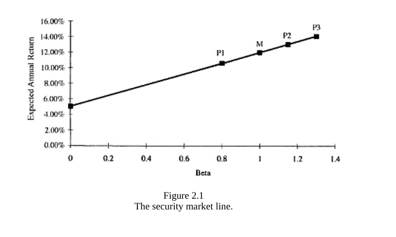
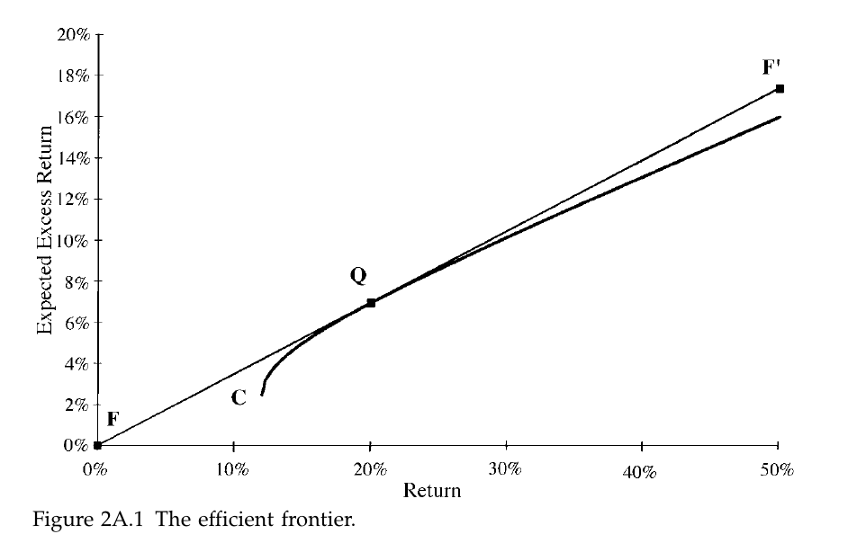

# Ch2 Consensus Expected Returns: The CAMP

### Learning Plan

April 30 - May 30, 31 days

__Part 1 Foundations__

**Ch2 Consensus Expected Returns: The CAMP   11- 40**

Ch3 Risk  41 - 85

Ch4 Exceptional Return, Benchmarks, and Value Added  87 - 108

Ch5 Residual Risk and Return: The Information Ratio 109 - 145

Ch6 The Fundamental Law of Active Management 147 - 169

__Part 2 Expected Returns and Valuation__

Ch7 Expected Returns and the Arbitrage Pricing Theory 173 - 198

Ch8 Valuation in Theory 199 - 224

Ch9 Valuation in Practice 225 - 257

__Part 3 Information Processing__

Ch10 Forecasting Basics  261 - 293

Ch11 Advanced Forecasting 295 - 314

Ch12 Information Analysis 315 - 345

Ch13 The Information Horizon 347 - 374

__Part 4 Implementation__

Ch14 Portfolio Construction 377 - 418

Ch15 Long/Short Investing 419 - 443

Ch16 Transaction Costs, Turnover, and Trading 445 - 475

Ch17 Performance Analysis 477 - 515

Ch18 Asset Allocation 517 - 539

Ch19 Benchmark Timing  541 - 558

Ch20 The Historical Record for Active Management 559 - 571

Ch21 Open Questions 573 - 576

Ch22 Summary 577 - 580

__Appendix C: Return and Statistics Basics__

## 1.1 Introduction

1. CAPM is a procedure for determining consensus expected return
2. Key points:
   1. return = systematic (market) component + residual component (no theory required)
   2. CAPM says E(residual component) = 0
   3. CAPM is easy to understand and to implement
   4. There is a powerful logic of market efficiency behind the CAPM
   5. CAPM thrusts the burden of proof onto the active manager
   6. CAPM provides a valuable source of consensus expectations
   7. CAPM is about expected returns, not risk.
3. Alternative to consensus return:
   1. historical average returns, but it is bad
      1. it contains a large amount of sample error
      2. The universe of stocks changes over time
   2. arbitrage pricing theory (APT)
      1. it can work as an interesting tool but not as a source of consensus expected returns
4. The market portfolio is the consensus portfolio, and the CAPM leads to the expected returns which make the market mean/variance optimal.

## 1.2 Separation of Return

1. two construction: market portfolio $M$, and $\beta$

2. denote portfolio $P$, excess return $r_p$,  $r_M$

3. $\beta_{p}=\frac{\operatorname{Cov}\left(r_{p}, r_{M}\right)}{\operatorname{Var}\left(r_{M}\right)}$

4. $r_{p}(t)=\alpha_{p}+\beta_{p} r_{M}(t)+\epsilon_{p}(t)$

   1. $\alpha_p, \beta_p$ is _realized_ or _historical_ alpha and beta, in order to distinguish them from their forward-looking counterparts.

5. $r_{p}=\beta_{p} r_{M}+\theta_{p}$

   1. break excess return into market component and residual component

   2. the _residual return_ $\theta_p$ will be uncorrelated with the market return $r_M$, and so the variance of $P$ is

      $\sigma_{p}^{2}=\beta_{p}^{2} \sigma_{M}^{2}+\omega_{p}^{2}$

      Where $\omega_p^2$ is the residual variance of portfolio $P$, i.e. the variance of $\theta_p$

## 1.3 The CAPM

1. The CAPM states that the expected residual return on all stocks and any portfolio is equal to 0, i.e., that $E\{\theta_p\} = 0$. 

   1. This means that the expected excess return on the portfolio $E\{r_p\} = \mu_p$, is determined entirely by the expected excess return on the market $E\{r_M\} = \mu_M$, and the portfolio’s beta $\beta_p$.

      $E[r_p] = \beta_pE[r_M] = \beta_p \mu_M$

   2. This implicit that CAPM assume all investors have the same expectations, and differ only in their tolerance for risk.

   3. Note: CAPM _must_ hold for the market portfolio, because the value-weighted returns of all the stocks is the market return, so the residual returns has to be exactly zero. However, the CAPM goes much further and says the expected residual return of each stock is 0.

## 1.4 CAPM is Sensible

1. Logic: investors are compensated for taking necessary risks, but not for taking unnecessary risks. Residual Risk, is self-imposed, which can be avoided by all investors.
2. investors who don’t think they have superior information should hold the market portfolio. 

## 1.5 The CAPM and Efficient Markets Theory

1. Three markets
   1. Weak: investors cannot outperform the market using only historical price and volume data
   2. SemiStrong: Investor cannot outperform the market using only publicly available information: historical prices + fundamental data, analysts’ published recommendations, etc
   3. Strong: market prices contain all relevant information
2. as long as there are no “greater fools”, we shouldn’t expect either of those investors to outperform the market.

## 1.6 Expected Returns and Portfolios 

1. An active manager does not hold the market or consensus portfolio. Hence, this manager’s expected returns will not match the consensus expected returns

## 1.7 Ex Post and Ex Ante

1. CAPM-derived expected return against the betas of those stocks and portoflio, it is a straight line. _security market line_

## 1.8 How Well Does the CAPM Work?

1. The ability to decompose return and risk into market and residual components depends on the ability to forecast betas

## 1.9 Relevance for Active Managers

1 market players have differential information and thus different expectations. Superior information offers managers superior opportunities.

2. The CAPM has shifted the burden of proof to the active manager
3. The CAPM also helps active managers by distinguishing between the market and the residual component of return.

## 1.10 Forecast of Beta and Expected Market Returns

1. historical beta derived from an analysis of past returns
2. some more complicated ones use bayesian adjustment to these historical betas

# Problems

1. -5.25%
2. 7.35%
3. corr  = $\frac{\beta_1\beta_2Vol_M^2}{Vol_1Vol_2}$,  $Vol_{res,1} = sqrt{Vol_1^2 - \beta_1^2Vol_M^2}$, $Vol_{res,2} = sqrt{Vol_2^2 - \beta_2^2Vol_M^2}$
4. ?
5. 0

# Technique Appendix

1. mean/ variance analysis 
2. mathematical notation
   1. $\mathbf{h}$: the vector of risky asset holdings, % weight
   2. $\mathbf{f}$: vector of expected returns
   3. $\mathbf{\mu}$: __vector__ of expected excess returns under the CAPM; i.e., the CAPM holds when $\mathbf{f} = \mu$
   4. $\mathbf{V}$: covariance matrix of excess returns for the risky assets
   5. $\mathbf{\beta}$: vector of asset betas
   6. $\mathbf{e}$: vector of ones.  
3. preliminary assumptions
   1. A risk-free asset exists
   2. all first and second moments exist
   3. It is not possible to build a fully invested portfolio that has zero risk
   4. the expected excess return on portfolio $C$, the fully invested portfolio with minimum risk, is positive
4. “characterist portfolios”
   1. uniquely capture the defining attribute, allow us to connect attributes and portfolio, and to identify a portfolio’s exposure to the attribute in terms of its covariance with the characteristic portfolio.
   2. $C$, the minimum-variance portfolio
   3. $Q$, the portfolio with the highest ratio of expected return to standard deviation of return
   4. efficient frontier describs a set of characteristic portfolios

## Characteristic Portfolios

1. Let $\mathbf{a}^{T}=\left\{a_{1}, a_{2}, \ldots, a_{N}\right\}$ be any vector of asset attributes or characteristics. The _exposure_ of  portfolio $\mathbf{h}_{p}$ to attribute $\mathbf{a}$ is simply $\mathbf{a_{p}}=\sum_n \mathbf{a_{n}} \mathbf{h_{P,n}}$

2. Propositions 1

   1. For any attribute $\mathbf{a} \ne 0$, there is a unique portfolio $\mathbf{h_a}$ that has minimum risk and unit exposure to $a$. The holdings are (2A.1)

      $\mathbf{h}_{a}=\frac{\mathbf{V}^{-1} \mathbf{a}}{\mathbf{a}^{T} \mathbf{V}^{-1} \mathbf{a}}$

   2. The variance of portfolio $\mathbf{h_a}$ is  (2A.2)

      $\sigma_{a}^{2}=\mathbf{h}_{a}^{T} \mathbf{V h}_{a}=\frac{1}{\mathbf{a}^{T} \mathbf{V}^{-1} \mathbf{a}}$

   3. The beta of all assets w.r.t portfolio $\mathbf{h_a}$ is equal to $\mathbf{a}$ (2A.3)

      $\mathbf{a}=\frac{\mathbf{V} \mathbf{h_a}}{\sigma_{a}^{2}}$

   4. consider  two attributes $\mathbf{a}$ and $\mathbf{d}$ with characteristic portfolio $\mathbf{h_a}, \mathbf{h_d}$. let $a_d$ be the exposure of portfolio $\mathbf{h_d}$ to characteristic $a $, and same thing applies to $d_a$ as well. Then the covariance of the characteristic portfolio satisfies (2A.4)

      $\sigma_{a d}=a_{d} \sigma_{a}^{2}=d_{a} \sigma_{a}^{2}$ 

   5. if $\kappa$ is a positive scalar, then the characteristic portfolio of $\kappa a $ is $\frac{\mathbf{h_a}}{\kappa}$. because unit exposure stays the same.

   6. if characteristic a is a weighted combination of characteristic d and f, i,e, $a = \kappa_d d + \kappa_f f$ (2A.5), then  $\mathbf{h}_{a}=\left(\frac{\mathbf{k}_{d} {\sigma}_{a}^{2}}{\sigma_{d}^{2}}\right) \mathbf{h}_{d}+\left(\frac{\mathbf{k}_{f} {\sigma}_{a}^{2}}{\sigma_{f}^{2}}\right) \mathbf{h}_{f}$, where $\frac{1}{\sigma_{\mathbf{a}}^{2}}=\left(\frac{\kappa_{d} a_{d}}{\sigma_{d}^{2}}\right)+\left(\frac{\kappa_{f} a_{f}}{\sigma_{f}^{2}}\right)$ (2A.6)

3. Proof

   1. derive the holdings of the characteristic portfolio by solving the defining optimization problem: minimum risk, given the constraint that its exposure to characteristic $a$ is 1.

      $\min \mathbf{h}^T \mathbf{V} \mathbf{h}$

      $s.t. \ \mathbf{h}^T\mathbf{a} = 1$   (2A.7)

      We can write it in Lagrange form and then take derivative w.r.t $\mathbf{h}$ so we can get $\mathbf{Vh}-\theta \mathbf{a}=0$ (2A.8), use $\theta$ as lagrange multiplier, so $\mathbf{h}$ is proportional to $\mathbf{V}^{-1}\mathbf{a}$, with proportionality constant $\theta$, plug in the $h$ to (2A.7) , we can get  $\theta=\frac{1}{\mathbf{a}^{T} \mathbf{V}^{-1} \mathbf{a}}$  (2A.10 ) and so $\mathbf{h}_{\mathbf{a}}=\frac{\mathbf{V}^{-1} \mathbf{a}}{\mathbf{a}^{T} \mathbf{V}^{-1} \mathbf{a}}$  (2A.9)

   2. we can verify it by (2A.9) and the definition of portfolio variance

   3. we can verify it by using the definition of $\beta$ w.r.t porfolio $P$ as $\frac{\mathbf{Vh_P}}{\sigma_P^2}$

   4. $\begin{align}\sigma_{ad} = \mathbf{h_a}^T V \mathbf{h_d}= (\mathbf{h_a}^T V) \mathbf{h_d} = \mathbf{h_a}^T (V \mathbf{h_d}) \end{align} = \mathbf{h_a}^T (\sigma_d^2\mathbf{d}) = d_a\sigma_d^2$

   5. items 5 and 6.

4. Proposition 2: portfolio with the maximum Sharpe ratio

   Let q be the characteristic portfolio of the expected excess return f:

   $\mathbf{h}_{q}=\frac{\mathbf{V}^{-1} \mathbf{f}}{\mathbf{f}^{T} \mathbf{V}^{-1} \mathbf{f}}$

   1. $SR_q = \max{SR_q|P} = (\mathbf{f}^T\mathbf{V}^{-1}\mathbf{f})^{\frac{1}{2}}$

   2. $f_q = 1$,   $\sigma_{q}^{2}=\frac{1}{\mathbf{f}^{T} \mathbf{V}^{-1} \mathbf{f}}$

   3. $\begin{aligned} \mathbf{f} &=\frac{\mathbf{Vh}_{q}}{\sigma_{q}^{2}} \\ &=\left(\frac{\mathbf{Vh}_{q}}{\sigma_{q}}\right) \mathbf{SR}_{q} \end{aligned}$

   4. if $\rho_{P,q}$ is the correlation between portfolios P and q, then

      $\mathrm{SR}_{p}=\rho_{P,q} \mathrm{SR}_{q}$

   5. The fraction of q invested in risky assets is given by 

      $e_{q}=\frac{f_{C} \sigma_{q}^{2}}{\sigma_{C}^{2}}$

5. Proposition 3:

   Assume that $f_C \gt 0$

   1. Portfolio $q$ is net long: $e_q \gt 0$

      Let portfolio $Q$ be the characteristic portfolio of $e_q \mathbf{f}$. Portfolio $Q$ is fully invested, with holdings $\mathbf{h_Q} = \mathbf{h_q} / e_q$. In addition, $SR_Q = SR_q$, and for any portfolio $P$ with a correlation $\rho_{P,Q}$ with portfolio $Q$, we have 

      $SR_P = \rho_{P,Q} SR_Q$

   2. $\frac{f_C}{\sigma_C^2} = \frac{f_Q}{\sigma_Q^2}$

      $\mathbf{f}=f_{Q}\left(\frac{\mathbf{V} \mathbf{h}_{Q}}{\sigma_{Q}^{2}}\right)=f_{Q} \boldsymbol{\beta}_{\mathrm{with} \text { respect to } Q}$

   3. $\beta_{Q}=\frac{f_{B} \sigma_{Q}^{2}}{f_{Q} \sigma_{B}^{2}}$

   4. If the benchmark is fully invested, $e_{B}=1,$ then
      $$
      \beta_{Q}=\frac{\beta_{C} f_{B}}{f_{C}}
      $$

### Partial List of Characteristic Portfolios

1. | Characteristic                                     | Portfolio                       |
   | -------------------------------------------------- | ------------------------------- |
   | $\mathbf{f}$                                       | $\mathbf{h}_q$                  |
   | $e_q\mathbf{f}$                                    | $\mathbf{h}_q$ (if $f_c \gt 0$) |
   | $\mathbf{\beta} $                                  | $\mathbf{h}_B$                  |
   | $\mathbf{e} $                                      | $\mathbf{h}_c$                  |
   | $\mathbf{\alpha} = \mathbf{f} - \mathbf{\beta}f_B$ | $\mathbf{h}_A$                  |

## The Efficient Frontier

1.  A fully invested portfolio is _efficient_ if it has minimum risk among all portfolios with the same expected return. Efficient frontier portfolios solve the minimization problem

   Minimize $\frac{\mathbf{h}^{T} \mathbf{V h}}{2}$

   s.t.

    $\mathbf{e}^{T} \mathbf{h}=1$
   $\mathbf{f}^{T} \mathbf{h}=f_{p}$

2. We can solve it and find : $\mathbf{h}_{P}=\left(\frac{f_{Q}-f_{P}}{f_{Q}-f_{C}}\right) \mathbf{h}_{C}+\left(\frac{f_{P}-f_{C}}{f_{Q}-f_{C}}\right) \mathbf{h}_{Q}$

## The Capital Asset Pricing Model

1. The vector of asset expected excess returns is proportional to the vector of asset betas w.r.t portfolio Q

2. Certain assumptions lead us to the conclusion that portfolio Q is the market portfolio M, i.e. that the market portfolio M is indeed the portfolio with the highest ratio of expected excess return to risk among all fully invested portfolio,. i.e. $\mathbf{f}=\boldsymbol{\mu}=\boldsymbol{\beta} \boldsymbol{\mu}_{M}$

   1. All investors have mean/ variance preference
   2. All assets are included in the analysis
   3. All investors know the expected excess returns
   4. All investors agree on asset variance and covariance
   5. There are no transaction costs or taxes.

   

