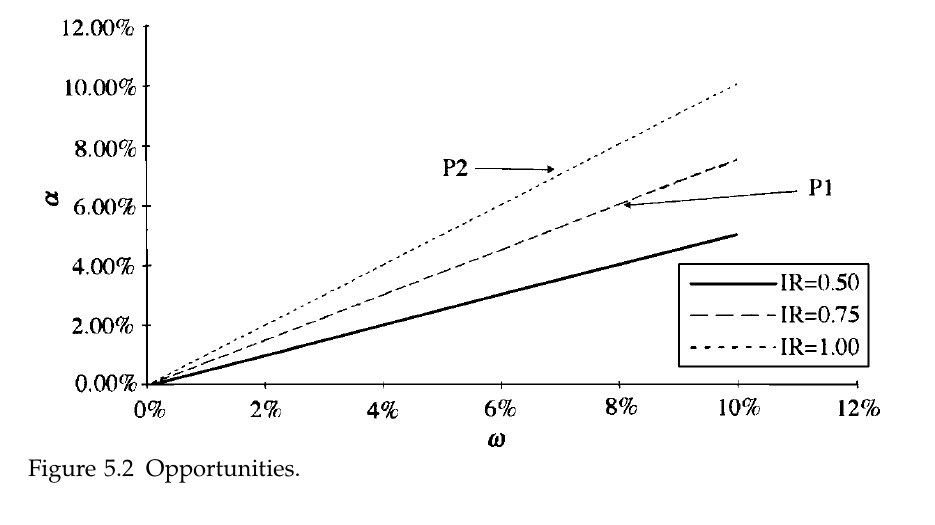
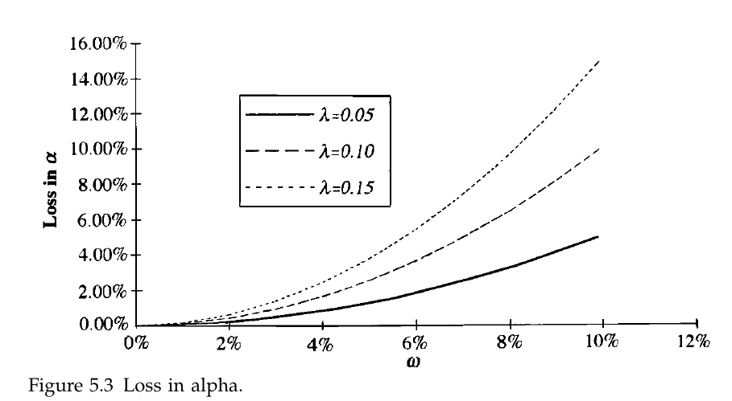
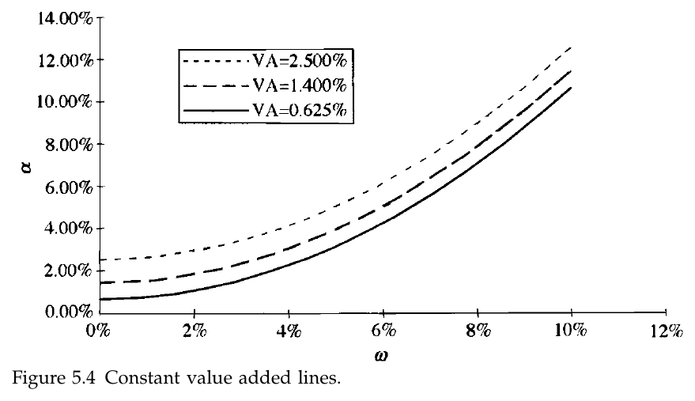
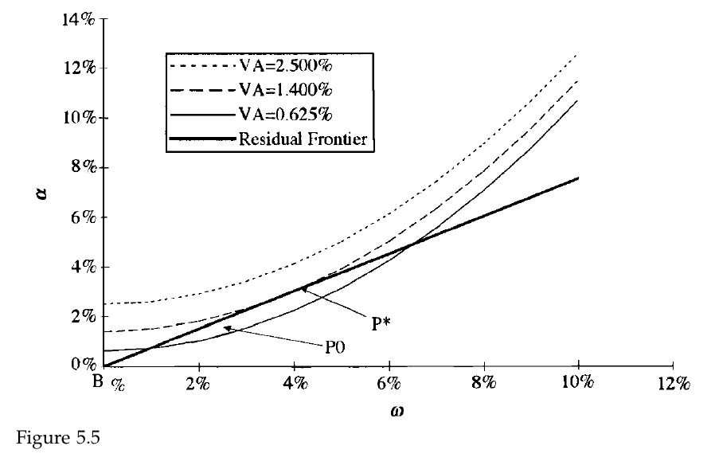
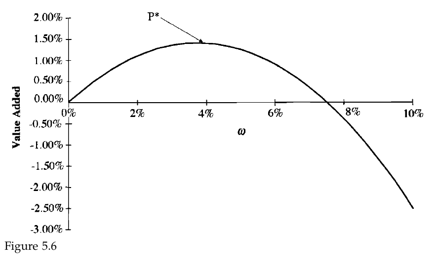

# Study Notes

### Learning Plan

April 30 - May 30, 31 days

__Part 1 Foundations__

Ch2 Consensus Expected Returns: The CAMP   11- 40  3.5h

Ch3 Risk  41 - 85  3h

Ch4 Exceptional Return, Benchmarks, and Value Added  87 - 108 2.5h

**Ch5 Residual Risk and Return: The Information Ratio 109 - 145**  2h

Ch6 The Fundamental Law of Active Management 147 - 169

__Part 2 Expected Returns and Valuation__

Ch7 Expected Returns and the Arbitrage Pricing Theory 173 - 198

Ch8 Valuation in Theory 199 - 224

Ch9 Valuation in Practice 225 - 257

__Part 3 Information Processing__

Ch10 Forecasting Basics  261 - 293

Ch11 Advanced Forecasting 295 - 314

Ch12 Information Analysis 315 - 345

Ch13 The Information Horizon 347 - 374

__Part 4 Implementation__

Ch14 Portfolio Construction 377 - 418

Ch15 Long/Short Investing 419 - 443

Ch16 Transaction Costs, Turnover, and Trading 445 - 475

Ch17 Performance Analysis 477 - 515

Ch18 Asset Allocation 517 - 539

Ch19 Benchmark Timing  541 - 558

Ch20 The Historical Record for Active Management 559 - 571

Ch21 Open Questions 573 - 576

Ch22 Summary 577 - 580

__Appendix C: Return and Statistics Basics__

## 5.1 Introduction

1. highlights
   1. _Information ratio_: achievement ex post (looking backward) and connotes opportunity ex ante (looking forward)
   2. The information ratio defines the _residual frontier_, the opportunities available to the active manager
   3. Each manager’s information ratio and residual risk aversion determine his or her level of aggressiveness (residual risk)
   4. _Intuition_ can lead to reasonable values for the information ratio and residual risk aversion
   5. Value _added_ depends on the manager’s opportunities and aggressiveness

## 5.2 Definition of Alpha

1. Looking forward (ex ante), alpha is a forecast of residual return
2. Looking backward (ex post), alpha is the average of the realized residual returns
3. $r_{P}(t)=\alpha_{P}+\beta_{P} \cdot r_{B}(t)+\epsilon_{P}(t)$
   1. $r_P(t)$ is portfolio excess returns, $r_B(t)$ is benchmark excess returns. The estimates of $\beta_P$ and $\alpha_P$ are the realized or historical beta and alpha
4. Residual Return $\theta_{P}(t)=\alpha_{P}+\epsilon_{P}(t)$
   1. $\epsilon_P$ is the mean 0 random component of residual return
   2. $\alpha_{n}=E\left\{\theta_{n}\right\}$
5. Benchmark portfolio and risk-free portfolio have 0 residual return
6. The requirement that $\alpha_B = 0$

## 5.3 The ex post information ratio: a measure of achievement

1. _information ratio (IR)_: a ratio of (annualized) residual return to (annualized) residual risk.
2. A realized information ratio can (and frequently will) be negative
3. The ex-post information ratio is related to the t statistic one obtains for the alpha in the regression. If the data in the regression cover $Y$ years, then the information ratio is approximately the alpha’s t statistic divided by the square root of Y

## 5.4 The Ex Ante Information Ratio: A measure of opportunity

1. $$\begin{array}{cc}
   \text { Percentile } & \text { Information Ratio } \\
   \hline 90 & 1.0 \\
   75 & 0.5 \\
   50 & 0.0 \\
   25 & -0.5 \\
   10 & -1.0
   \end{array}$$
2. $IR = 0.75$ is very good
3. _Information ratio for portfolio P_ : $\mathrm{IR}_{P}=\frac{\alpha_{P}}{\omega_{P}}$
4. our personal “information ratio” is the maximum information ratio that we can attain over all possible portfolios: $\mathrm{IR}=\operatorname{Max}\left\{\mathrm{IR}_{p} | P\right\}$
5. **IR is independent of the manager’s level of aggressiveness**
   1. it breaks down in real-world, because of constraints

## 5.5 The Residual Frontier: The manager’s opportunity set

1. The Information ratio defines s “budget constriant” for the active manager:

   $\alpha_{P}=\mathrm{IR} \cdot \omega_{P}$

   1. At best (i.e. along the frontier), the manager can increase the expected residual return only through a corresponding increase in the residual risk.

## 5.6 The Active Management Objective 

1. maximize the value added from the residual return

   $\operatorname{VA}[P]=\alpha_{P}-\lambda_{R} \cdot \omega_{P}^{2}$

2. 

3. 

4. Sometimes we refer to the VA as the _certainty equivalent return_.

## 5.7 Preferences meet opportunities

## 5.8 Aggressiveness, opportunity, and residual risk aversion

1. $\mathrm{VA}\left[\omega_{P}\right]=\omega_{P} \cdot \mathrm{IR}-\lambda_{R} \cdot \omega_{P}^{2}$
2. $\omega^{*}=\frac{\mathrm{IR}}{2 \lambda_{R}}$
3. 
4. $$\begin{array}{lccc} 
   & {\text { Risk Aversion } \lambda} \\
   \text { IR } & \begin{array}{c}
   \text { Aggressive } \\
   (0.05) 
   \end{array} & \begin{array}{c}
   \text { Moderate } \\
   (0.10)
   \end{array} & \begin{array}{c}
   \text { Restrained } \\
   (0.15)
   \end{array} \\
   \hline \text { Exceptional (1.00) } & 10.00 \% & 5.00 \% & 3.33 \% \\
   \text { Very good (0.75) } & 7.50 \% & 3.75 \% & 2.50 \% \\
   \text { Good (0.50) } & 5.00 \% & 2.50 \% & 1.67 \%
   \end{array}$$

## 5.9 Value Added: Risk-Adjusted Residual Return

1. Plug in the optimal level od residual risk into the VA equation 

   $$\mathrm{VA}^{*}=\mathrm{VA}\left[\omega^{*}\right]=\frac{\mathrm{IR}^{2}}{4 \lambda_{R}}=\frac{\omega^{*} \cdot \mathrm{IR}}{2}$$           **(5.12)**

2. The ability of the manger to add value increases as the _square_ of the information ratio and decreases as the manager becomes more risk-averse

3. Every investor seeks the strategy or manager with the highest information ratio

### 5.9.1 The IR is the key to active management

$$
\begin{array}{lccc} 
& {\text { Risk Aversion } \lambda} \\
\text { IR } & \begin{array}{c}
\text { Aggressive } \\
(0.05) 
\end{array} & \begin{array}{c}
\text { Moderate } \\
(0.10)
\end{array} & \begin{array}{c}
\text { Restrained } \\
(0.15)
\end{array} \\
\hline \text { Exceptional (1.00) } & 5.00 \% & 2.50 \% & 1.67 \% \\
\text { Very good (0.75) } & 2.81 \% & 1.41 \% & 0.94 \% \\
\text { Good (0.50) } & 1.25 \% & 0.63 \% & 0.42 \%
\end{array}
$$

## 5.10 The $\beta = 1$ Frontier

## 5.11 Forecast Alphas directly

1. Converting a simple ranking of stocks into alpha forecasts
   1. sort the assets into five bins: strong, buy, but hold ,sell and strong sell
   2. assign them respective alphas of 2%, 1%, 0%, -1%, and -2%
2. These alphas need to be benchmark-neutral
3. Any procedure that keeps the process simple and moving in the correct direction will probably compensate for losses in accuracy in the second and third decimal place
4. Although it may be difficult to forecast alphas correctly, it is not difficult to forecast alphas directly

## 5.12 Empirical Observations

1.Information Ratio, U.S. Active __Equity__ Investment

$$\begin{array}{ccccc} 
&  {\text { Mutual Funds }} & & {\text { Institutional Portfolios }} \\
 \text { Percentile } & \text { Before Fees } & \text { After Fees } &  \text { Before Fees } & \text { After Fees } \\
\hline 90 & 1.33 & 1.08 & 1.25 & 1.01 \\
75 & 0.78 & 0.58 & 0.63 & 0.48 \\
50 & 0.32 & 0.12 & -0.01 & -0.15 \\
25 & -0.08 & -0.33 & -0.56 & -0.72 \\
10 & -0.47 & -0.72 & -1.03 & -1.25
\end{array}$$

2. Information Ratio, U.S. Active __Bond__ Investment

$$\begin{array}{cccc}
&{\text { Mutual Funds }} &&  {\text { Institutional Portfolios }} \\
 \text { Percentile } & \text { Before Fees } & \text { After Fees } & \text { Before Fees } & \text { After Fees } \\
\hline 90 & 1.14 & 0.50 & 1.81 & 1.29 \\
75 & 0.50 & -0.22 & 0.89 & 0.38 \\
50 & -0.11 & -0.86 & 0.01 & -0.57 \\
25 & -0.61 & -1.50 & -0.62 & -1.37 \\
10 & -1.22 & -2.21 & -1.50 & -2.41
\end{array}$$

3. Annual Active Risk (Equity)

$$\begin{array}{ccc}
\text { Percentile } & \text { Mutual Funds } & \text { Institutional Portfolios } \\
\hline 90 & 9.87 \% & 9.49 \% \\
75 & 7.00 \% & 6.47 \% \\
50 & 4.76 \% & 4.39 \% \\
25 & 3.66 \% & 2.85 \% \\
10 & 2.90 \% & 1.93 \%
\end{array}$$

4. Annual Active Risk (Bond)

$$\begin{array}{ccc}
\text { Percentile } & \text { Mutual Funds } & \text { Institutional Portfolios } \\
\hline 90 & 3.44 \% & 1.89 \% \\
75 & 2.01 \% & 0.98 \% \\
50 & 1.33 \% & 0.61 \% \\
25 & 0.96 \% & 0.41 \% \\
10 & 0.74 \% & 0.26 \%
\end{array}$$

# Problems

1. 0
2. $\mathrm{VA}^{*}=\mathrm{VA}\left[\omega^{*}\right]=\frac{\mathrm{IR}^{2}}{4 \lambda_{R}}=\frac{\omega^{*} \cdot \mathrm{IR}}{2}$
3. ?
4. $\mathrm{VA}^{*}=\mathrm{VA}\left[\omega^{*}\right]=\frac{\mathrm{IR}^{2}}{4 \lambda_{R}}=\frac{\omega^{*} \cdot \mathrm{IR}}{2}$
5. $\mathrm{VA}^{*}=\mathrm{VA}\left[\omega^{*}\right]=\frac{\mathrm{IR}^{2}}{4 \lambda_{R}}=\frac{\omega^{*} \cdot \mathrm{IR}}{2}$
6. $\mathrm{VA}^{*}=\mathrm{VA}\left[\omega^{*}\right]=\frac{\mathrm{IR}^{2}}{4 \lambda_{R}}=\frac{\omega^{*} \cdot \mathrm{IR}}{2}$

