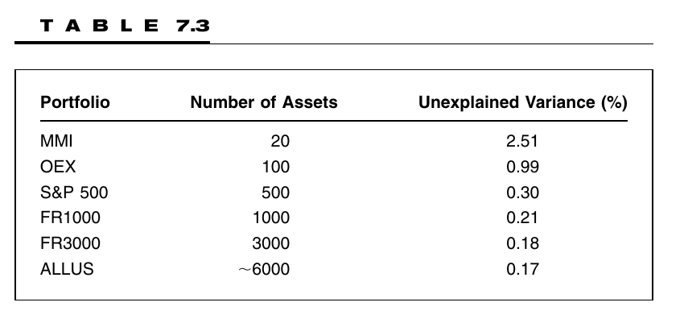

# Study Notes

### Learning Plan

April 30 - May 30, 31 days

__Part 1 Foundations__

Ch2 Consensus Expected Returns: The CAMP   11- 40  3.5h

Ch3 Risk  41 - 85  3h

Ch4 Exceptional Return, Benchmarks, and Value Added  87 - 108 2.5h

Ch5 Residual Risk and Return: The Information Ratio 109 - 145  2h

Ch6 The Fundamental Law of Active Management 147 - 169 1.5h

__Part 2 Expected Returns and Valuation__

**Ch7 Expected Returns and the Arbitrage Pricing Theory 173 - 198** 1.5h

Ch8 Valuation in Theory 199 - 224

Ch9 Valuation in Practice 225 - 257

__Part 3 Information Processing__

Ch10 Forecasting Basics  261 - 293

Ch11 Advanced Forecasting 295 - 314

Ch12 Information Analysis 315 - 345

Ch13 The Information Horizon 347 - 374

__Part 4 Implementation__

Ch14 Portfolio Construction 377 - 418

Ch15 Long/Short Investing 419 - 443

Ch16 Transaction Costs, Turnover, and Trading 445 - 475

Ch17 Performance Analysis 477 - 515

Ch18 Asset Allocation 517 - 539

Ch19 Benchmark Timing  541 - 558

Ch20 The Historical Record for Active Management 559 - 571

Ch21 Open Questions 573 - 576

Ch22 Summary 577 - 580

__Appendix C: Return and Statistics Basics__

## 7.1 Introduction

1. Highlights:
   1. APT is a model of **expected returns**
   2. Application of the APT is an art, not a science (interesting…)
   3. The APT points the quantitative manager toward the relationship between factors and expected returns
   4. APT factors can be defined in a multitude of ways. These may be fundamental, technical, or macro factors.
   5. The flexibility of the APT makes it inappropriate as a model for _consensus_ expected returns, but an appropriate model for a _manager’s_ expected returns
   6. The APT is a source of information to the active manager. It should be flexible. If all active managers shared the same information, it would be worthless.
2. Why “Arbitrage”?  APT says that it is _possible_ to forecast expected stock returns but it doesn’t tell you _how_ to do so.
3. The theory doesn’t say what the factors are, how to calculate a stock’s exposure to the factors, or what the weights should be in the linear combination (art, not science)

## 7.2 Trouble with the CAPM

1. The most grievous of the assumptions is the CAPM requirement that all participants know every stock’s expected excess return.

## 7.3 The APT

1. APT postulates a multiple-factor model of excess returns
2. $r_{n}=\sum_{k=1}^{K} X_{n, k} \cdot b_{k}+u_{n}$    (7.1)
   1. $X_{n,k}$ = the _exposure of stock n to factor k_. The exposures are frequently called _factor loadings_. For practical purposes, we will assume that the exposures are known before the returns are observed
   2. $b_k$ = the _factor return_ for factor _k_. These factor returns are either attributed to the factors at the end of the period or observed during the period
   3. $u_n$ = stock n’s _specific return_, the return that cannot be explained by the factors. It is sometimes called the idiosyncratic return to the stock. 
3. It is the same structure with the structural risk model, but the focus is now on expected returns, not risk.
4. The APT is about expected excess returns: $f_{n}=E\left\{r_{n}\right\}=\sum_{k=1}^{K} X_{n, k} \cdot m_{k} $    (7.2)
   1. $m_k$ is the _factor forecast_ for factor _k_. The theory says that a correct factor forecast will exist. __It doesn’t say how to find it__

## 7.4 The APT Rationale

## 7.5 The Easy part: finding a qualified model

1. A factor model of the type described in Eq (7.1) is qualified, i.e., Eq (7.2) will hold for some factor forecasts $m_k$, **if and only if** portfolio $Q$ is **diversified w.r.t. that factor model**, which means that among all portfolio with the same factor exposures as portfolio $Q$, portfolio $Q$ has minimum risk.
2.   portfolios are highly diversified w.r.t. the BARRA model.

3. **Any factor model that is good at explaining the risk of a diversified portfolio should be (nearly) qualified as an APT model**

## 7.6 The Hard Part: Factor Forecasts

1. If we hope that the past average helps in the future, we are implicitly assuming an element of stationary in the market.
2. **Factor forecasts are difficult. Structure should help**

## 7.7 Applications

1. Structural Models
   1. macroeconomic, fundamental, or market-related
2. Statistical Models
3. **There are a great many ways to build an APT model.**

### 7.7.1 Structural Model 1: Given Exposures, Estimate Factor Returns

1. BARRA model.

### 7.7.2 Structural Model 2: Given Factor Returns, Estimate Exposures ?

1. take the factor returns as the return on the value-weighted NYSE, gold, a government bond index, a basket of foreign currencies, and a basket of traded commodities.
2. Set the exposure of each stock to the NYSE equal to $1 .$ For the other factors, determine the past exposure of the stock to the factor returns by regressing the difference between the stock return and the NYSE return on the returns of the other factors.
3. The factor forecasts are forecasts of the future value of the factor returns. Note that we hope that the estimated factor exposures are stable over time.

### 7.7.3 Structural Model 3: Combine Structural Models 1 and 2

1. Start with model 2, then attribute returns to the factors as in structural model 1.

### 7.7.4 Statistical Model 1: PCA?

### 7.7.5 Statistical Model 2: Maximum Likelihood Factor Analysis

### 7.7.6 Statistical Model 3: The Dual of Statistical Model 2

# Problems

1. 0.
2. ?. market.
3. residual in the CAPM captured by the APT is negative. No need to match, if the factor in APT has little correlation with market, then it is acceptable, as it capture some aspects of the residual part from the CAPM model.
   1. however, if the APT model cover a lot of factors, they should be the same
4.  stationary
5. 1*6 - 2 * 0.24 - 1 * 0.13 - 0.5 * 1.56 + 1 * 0.15 + 6 * 1.1 - 1.1 * 6 = 6-0.48 - 0.13 - 0.78 + 0.15 - 6.6 = -1.84 %