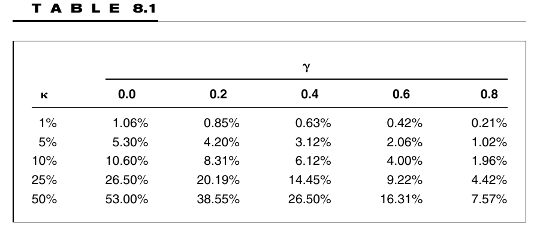

# Study Notes

### Learning Plan

April 30 - May 30, 31 days

__Part 1 Foundations__

Ch2 Consensus Expected Returns: The CAMP   11- 40  3.5h

Ch3 Risk  41 - 85  3h

Ch4 Exceptional Return, Benchmarks, and Value Added  87 - 108 2.5h

Ch5 Residual Risk and Return: The Information Ratio 109 - 145  2h

Ch6 The Fundamental Law of Active Management 147 - 169 1.5h

__Part 2 Expected Returns and Valuation__

Ch7 Expected Returns and the Arbitrage Pricing Theory 173 - 198 1.5h

**Ch8 Valuation in Theory 199 - 224** 1h

Ch9 Valuation in Practice 225 - 257

__Part 3 Information Processing__

Ch10 Forecasting Basics  261 - 293

Ch11 Advanced Forecasting 295 - 314

Ch12 Information Analysis 315 - 345

Ch13 The Information Horizon 347 - 374

__Part 4 Implementation__

Ch14 Portfolio Construction 377 - 418

Ch15 Long/Short Investing 419 - 443

Ch16 Transaction Costs, Turnover, and Trading 445 - 475

Ch17 Performance Analysis 477 - 515

Ch18 Asset Allocation 517 - 539

Ch19 Benchmark Timing  541 - 558

Ch20 The Historical Record for Active Management 559 - 571

Ch21 Open Questions 573 - 576

Ch22 Summary 577 - 580

__Appendix C: Return and Statistics Basics__

## 8.1 Introduction

1. Highlights:
   1. The modern theory of valuation connects stock values to risk-adjusted expected cash flows
   2. The theory is closely related to the theory of option pricing, and is consistent with the CAPM and the APT
   3. valuation is connected to expected returns

## 8.2 The Modern theory of valuation

### 8.2.1 Certain Cash Flows

1. $p=\frac{\mathrm{cf}(t)}{\left(1+i_{F}\right)^{t}}$
2. $p=\sum_{t=1}^{T} \frac{\mathrm{cf}(t)}{\left(1+i_{F}\right)^{t}}$

### 8.2.2 Uncertain Cash Flows

1. $E\{\mathrm{cf}(t)\}=\sum \pi(t, s) \cdot \mathrm{cf}(t, s)$   (8.4)
2. $p<\frac{E\{\mathrm{cf}(t)\}}{\left(1+i_{F}\right)^{t}}=\frac{\sum_{s} \pi(t, s) \cdot \mathrm{cf}(t, s)}{\left(1+i_{\mathrm{F}}\right)^{t}}$   (8.5)
   1. Expected cash flows do not take account of risk

## 8.3 The Valuation Formula

1. properties of a reasonable formula:
   1. If all future cash flows are nonnegative, the value is nonnegative. 
   2. If we double (or triple or halve) the cash flows, the value should change in the same proportion. 
   3. If we add two sets of cash flows, the value of the total cash flow should be the sum of the values of each separately. 
   4. The valuation formula should reduce to Eq. (8.1) in the case of certain cash flows
   5. The formula should agree with the market value of securities.

## 8.4 Risk-Adjusted Expectations

1. Introduce a risk-adjusted interest rate

   $E\left\{\frac{\mathrm{cf}(t)}{p}\right\}=1+i_{F}+\beta \cdot f_{Q}$

   1. Where $cf(t)$ is the stock value in 1 year, and so

      $p=\frac{E\{\mathrm{cf}(t)\}}{1+i_{F}+\beta \cdot f_{Q}}$

      1. the risk-adjusted interest is based on the asset’s beta and the expected excess return to portfolio $Q$
      2. equity cost of capital: $i_F + \beta f_Q$

2. Obtain the risk adjustment by introducing value multiples $\nu(t,s)$, so the modified expectation can be written as 

   $E^{*}\{\mathrm{cf}(t)\}=E\{v(t) \cdot \mathrm{cf}(t)\}=\sum \pi(t, s) \cdot v(t, s) \cdot \mathrm{c} \mathrm{f}(t, s)$

   Where $\nu(t,s)$ is

   - Positive
   - with expected value 1
   - a function of the return to portfolio $Q$ and proportional to the total return on a portfolio $S$, the portfolio with minimum second moment of total return.

3. $p=\sum_{t=1}^{T} \frac{E^{*}\{\mathrm{cf}(t)\}}{\left(1+i_{F}\right)^{t}}$   **(8.9)**

4. if $\mathrm{cf}_{p}(t)=\sum_{n} h_{P, n} \cdot \mathrm{cf}_{n}(t)$, then $p=\sum_{t} \frac{E^{*}\left\{\mathrm{cf}_{P}(t)\right\}}{\left(1+i_{F}\right)^{t}}=\sum_{n} h_{P, n} \cdot p_{n}$

   1. Where $p_{n}=\sum_{t} \frac{E^{*}\left\{\mathrm{cf}_{n}(t)\right\}}{\left(1+i_{F}\right)^{t}}$

5. If the cash flow $\mathrm{cf}(t)$ is certain, then 

   $E^{*}\left\{\mathrm{cf}_{n}(t)\right\}=E\{v(t) \cdot \mathrm{cf}(t)\}=\mathrm{cf}(t) \cdot E\{v(t)\}=\mathrm{cf}(t)$

## 8.5 Interpretations

1. a new set of probabilities $\pi^{*}(t, s)=\pi(t, s) \cdot v(t, s)$

### 8.5.1 The Role of Covariance

1. $E^{*}\{\mathrm{cf}(t)\}=\operatorname{Cov}\{\mathrm{cf}(t), \boldsymbol{v}(t)\}+E\{\mathrm{cf}(t)\}$
2. an alternative interpretation is that the value multiples modify the cash flows by amplifying some and reducing others.
3. The marginal amount of cash flow is worth more when cash flow in general is scarce

## 8.6 Market-Dependent Valuation

## 8.7 Value and Expected Return

1. Find the link between the valuation formula and CAPM, APT

2. Suppose the stock currently price at $p(0)$, paying a dividend $d$ at the end of 1 year, and with an uncertain price $p(1)$ at the end of the year. If we sell the stock at the end of the year, the cash flow $cf(1) = d + p(1)$. The valuation formula is 

   $p(0)=\frac{E^{*}\{d+p(1)\}}{\left(1+i_{F}\right)}=\frac{E\{v(1) \cdot[d + p(1)]\}}{\left(1+i_{F}\right)}$     **(8.15)**

3. We can convert it to an expected return equation.  Define $R=[d+p(1)] / p(0)$, recall $E\{\nu(1)\} = 1$, we can write

   $E\{R\}=\left(1+i_{F}\right)-\operatorname{Cov}\{v, R\}$    **(8.16)**

   $E^{*}\{R\}=\left(1+i_{F}\right)=E\{v \cdot R\}$    **(8.17)**

4. (8.16) says that the expected excess return on all stocks is determined by their covariance with $\nu$. This is close to the CAPM and APT result, that the expected excess return on every stock is determined by its covariance with portfolio $Q$

5. (8.17) demonstrates that under the modified probabilities, the expected return on the risky investment  = the return on the risk-free investment

6. If  $p(0, \mathrm{mkt}) \neq \frac{E^{*}\{\mathrm{cf}(1)\}}{1+i_{F}}=p(0, \mathrm{mdl})$

7. We define two more variable

   $\kappa=\frac{p(0, \mathrm{mdl})-p(0, \mathrm{mkt})}{p(0, \mathrm{mkt})} $   (**8.19)**

   $\gamma \cdot \kappa=\frac{p(1, \mathrm{mdl})-p(1, \mathrm{mkt})}{p(1, \mathrm{mkt})+d}$   **(8.20)**

8. $\kappa$ measure the extend of misvaluation of the stock.  

9. $\gamma$ measures the persistence of the misvaluation: how long it will take for the market to learn what we know. 

   1. $\text{(fast idea)} \, 0 \le \gamma \le 1 \,  (\text{slow idea})$
   2. $-0.69/ln(\gamma)$ as the half-life time of the misvaluation, the number of years it will take for half the misvaluation to disappear

10.  (8.16) + (8.19) + (8.20) -> $E\{R\}=1+i_{F}-\operatorname{Cov}\{v, R\}+\alpha$   (8.21)

    1. Where  $\alpha=\left(1+i_{F}\right) \cdot\left[\frac{\kappa \cdot(1-\gamma)}{1+\kappa \cdot \gamma}\right]$   (8.22)
       1. it breaks the expected return into what we would expect if the stock were fairly valued and a second term that corrects for the market’s incorrect valuation of the stock.
       2. $\alpha=0$ if either $\kappa=0$ or $\gamma=1$ : if is no good if the world never learns that this stock is improperly valued
       3. if $\gamma =0$, then $\alpha=\left(1+i_{F}\right) \cdot \kappa$ , we realize the full benefit, plus interest, over the period.

Alpha for different levels of $\kappa$ and $\gamma$, assumes a 6 % annual interest rate 

# Problems

1. $p=\frac{E^{*}\{\mathrm{cf}(1)\}}{\left(1+i_{F}\right)}$
2. ?
3. ?
4. ?

